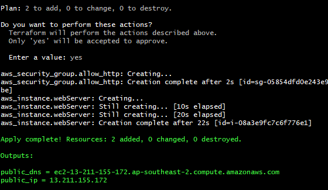
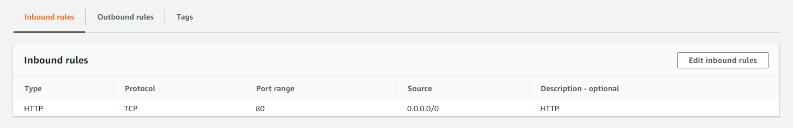

# ec2-terraform

This project demonstrates the concept of Infrastructure as Code using Terraform. In this project, we provision an EC2 service on AWS and deploy a web application. 

## Project File Structure
The project is divided into the following files:
```
- ec2.tf                        - EC2 resource declaration.
- outputs.tf                    - For outputting the public IP and DNS of the EC2 service.
- provider.tf                   - For setting up AWS connection.
- sg.tf                         - Security group definition.
- variables.tf                  - For prompting the user to enter access_key and secret_key.
- templates/ec2/user-data.sh    - The user data commands for deploying the application.
```

## Project Prerequisite

To deploy the application, you will need to have terraform as well an AWS account with an IAM user that has appropriate IAM permission to create and destroy EC2 instances. For testing purposes, we can add AmazonEC2FullAccess policy to the IAM user. However, in a production environment, we should follow the principle of least privilege be more restrictive.                                                 

Instruction for creating an IAM user on AWS: https://docs.aws.amazon.com/IAM/latest/UserGuide/id_users_create.html
Instruction for Adding and removing IAM identity permissions: https://docs.aws.amazon.com/IAM/latest/UserGuide/access_policies_manage-attach-detach.html
Instruction for setting up Terraform: https://learn.hashicorp.com/tutorials/terraform/install-cli

## How to clone and run the project

1. Clone this project by running `git clone https://github.com/shas38/ec2-terraform.git`
2. Change directory to ec2-terraform and run `terraform init`.
3. Once the initialisation process is complete run `terraform plan` to view the proposed changes.
4. If satisfied, then run `terraform apply` to deploy the EC2 service.
6. Terraform will prompt for the AWS Access Key ID and the Secret access key. You will need to have an AWS IAM user which has the permission to create an EC2 service for the project to work.
7. Once the deployment is complete the console will output the public IP address and DNS of the EC2 service.
8. You can view the application using either the public IP address or the DNS.
9. Please note it takes up to <b>five minutes</b> for the deployment of the application to complete. Hence, you might have to wait even if the EC2 deployment is instantaneous.



## Design Choices

1. AWS is chosen as it is a low cost and most popular cloud environment. 
2. As this is a web application the EC2 is deployed on the default public subnet which has inbound and outbound internet access.
3. The security group only allows traffic to port 80 and ssh into the server is not permitted. This was done to decrease the attack vector.
4. All outbound requests are allowed so that the server can install necessary dependencies.
5. When adding permissions to the IAM user follow the principle of least privilege so that the IAM user only has the required permission.
6. Terraform was chosen as it is one of the most popular technology for maintaining infrastructure as Code. Furthermore, Terraform deployments are Idempotent.
7. A terraform backend can be set up in S3 to persist the .tfstate across multiple environments.
8. Before deleting the project, make sure to `terraform destroy` to remove all the resources and avoid unnecessary costs.
9. In this project, I am using an Ubuntu Server 20.04 LTS AMI as it is free. We can easily swap this with another OS. However, we will have to change the commands in the user data accordingly.
10. ap-southeast-2 region is being used as this is the only region within Australia.
11. I am passing in the AWS Access Key ID and the Secret access key during runtime for ease of deployment. However, in a production environment, it is recommended either setting up AWS CLI or AWS-vault and getting the keys from there.



## Future Extension 

1. Currently, the application is deployed on a single server with no redundancy. The application can be deployed on multiple servers in multiple availability zones behind an elastic load balancer.
2. To follow a better DevOps practice, we can set up a CI/CD pipeline using GitLab CI and trigger the deployment every time something new is added to the master branch. That would prevent the need for having to deploy manually.